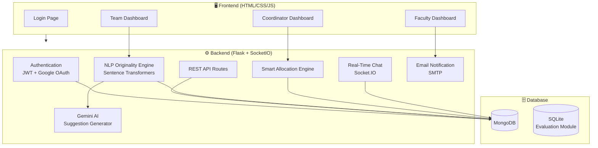

<p align="center">
  
  
  
  
  
  
</p>

# 🎓 Originality Check with Intelligent Student Project Management System

> An AI-powered academic project management platform that ensures project originality through NLP-based semantic analysis, provides intelligent supervisor allocation, and streamlines end-to-end project workflows for students, faculty, and coordinators.

---

## 📋 Table of Contents

- [Overview](#-overview)
- [Key Features](#-key-features)
- [System Architecture](#-system-architecture)
- [Tech Stack](#-tech-stack)
- [Project Structure](#-project-structure)
- [Installation & Setup](#-installation--setup)
- [Environment Variables](#-environment-variables)
- [Running the Application](#-running-the-application)
- [User Roles & Access](#-user-roles--access)
- [Modules in Detail](#-modules-in-detail)
- [API Endpoints](#-api-endpoints)
- [Project Evaluation System](#-project-evaluation-system-standalone-module)
- [Screenshots](#-screenshots)
- [Future Enhancements](#-future-enhancements)
- [Contributing](#-contributing)
- [License](#-license)

---

## 🌟 Overview

The **Originality Check with Intelligent Student Project Management System** is developed to address common challenges in academic project workflows, such as repeated project ideas, inefficient supervisor allocation, and lack of proper progress tracking.

In traditional systems, originality checks rely heavily on manual literature reviews and expert judgment — which can be time-consuming and may result in inaccuracies or unintentional duplication of ideas.

This system introduces an **AI-powered originality checking module** that uses **Natural Language Processing (NLP)** techniques to analyze the **semantic meaning** of project ideas, providing more accurate and meaningful feedback to both students and faculty members.

---

## 🚀 Key Features

### 🔍 AI-Powered Originality Detection
- Semantic similarity analysis using **Sentence Transformers** (`all-MiniLM-L6-v2`)
- Cosine similarity scoring against a database of existing projects
- AI-generated improvement suggestions via **Google Gemini API**
- Percentage-based originality scoring with most-similar project identification

### 🤖 Intelligent Supervisor Allocation
- Smart matching of student teams with faculty based on **interest-expertise overlap**
- Automated workload balancing (max 3 teams per faculty)
- Manual reallocation support with lock mechanism
- Hybrid allocation: preserves manual assignments during auto-allocation

### 📊 Structured Project Monitoring
- Weekly progress submissions with file upload support
- Multi-phase approval workflows (Synopsis, Design, Implementation, etc.)
- Task assignment with deadlines from faculty to teams
- Assessment marks tracking with per-member granularity

### 💬 Real-Time Communication
- Integrated **Socket.IO**-based chat system between students and faculty
- Room-based messaging organized by team name
- Persistent chat history stored in MongoDB

### 📧 Automated Email Notifications
- SMTP-based email alerts for:
  - New task assignments
  - Feedback received
  - Marks updates
- Keeps all stakeholders informed in real time

### 🔐 Google Authentication (OAuth 2.0)
- Seamless login via Google accounts using **Flask-Dance**
- Automatic role detection (Team / Faculty) on login
- New user redirection to registration flow

### 📈 Executive Analytics Dashboard
- Real-time insights into:
  - Total teams & faculty count
  - Allocation status (allocated vs. pending)
  - Project idea submission & approval rates
  - Faculty workload distribution
  - Team performance rankings (top & lowest performers)
  - Progress upload tracking

### 📝 Project Evaluation System (Standalone Module)
- University-grade evaluation matching **SMVITM** internal assessment format
- Phase-based evaluation (Synopsis, Design, Report, Attendance)
- Role-based access control (Faculty, Student, Coordinator)
- Printable A4 marksheet with PDF export
- SQLite-backed standalone database

---

## 🏗️ System Architecture



---

## 🛠️ Tech Stack

| Layer | Technology |
| :--- | :--- |
| **Backend Framework** | Flask (Python) |
| **Real-Time Communication** | Flask-SocketIO |
| **Database** | MongoDB (PyMongo) |
| **Authentication** | JWT + Google OAuth 2.0 (Flask-Dance) |
| **NLP / AI** | Sentence Transformers (`all-MiniLM-L6-v2`), NumPy |
| **AI Suggestions** | Google Gemini API (`gemini-2.5-flash`) |
| **Email Service** | Python `smtplib` (Gmail SMTP) |
| **Frontend** | HTML5, CSS3, Vanilla JavaScript |
| **Evaluation Module** | Node.js, Express.js, SQLite |
| **Security** | Werkzeug password hashing, JWT tokens |

---

## 📁 Project Structure

```
student_project_mgmt/
│
├── backend/
│   ├── app.py                 # Main Flask application (1500+ lines)
│   ├── requirements.txt       # Python dependencies
│   ├── .env                   # Environment variables (not tracked)
│   ├── .gitignore             # Git ignore rules
│   └── uploads/               # File uploads directory
│
├── frontend/
│   ├── login.html             # Login page with Google OAuth
│   ├── index.html             # Registration page
│   ├── team-dasboard.html     # Student/Team dashboard
│   ├── faculty-dashboard.html # Faculty dashboard
│   └── project_coordinator-dashboard.html  # Coordinator dashboard
│
├── Project-Evaluation-System/ # Standalone evaluation module
│   ├── backend/
│   │   ├── server.js          # Express.js REST API
│   │   ├── database.js        # SQLite connection
│   │   ├── seed.js            # Sample data seeder
│   │   ├── package.json       # Node.js dependencies
│   │   └── frontend/
│   │       ├── index.html     # Evaluation UI
│   │       ├── styles.css     # Marksheet styling
│   │       └── app.js         # Frontend logic
│   ├── database/
│   │   └── schema.sql         # SQLite schema definition
│   ├── assets/                # Branding assets
│   └── README.md              # Module-specific docs
│
├── test.py                    # Test script
└── README.md                  # This file
```

---

## ⚙️ Installation & Setup

### Prerequisites

| Requirement | Version |
| :--- | :--- |
| Python | 3.10+ |
| Node.js | 16+ (for Evaluation Module) |
| MongoDB | 4.x+ (running locally or Atlas) |
| Git | Latest |

### 1. Clone the Repository

```bash
git clone https://github.com/Prashanth-kulal/Originality_Checking_Of_The_Project.git
cd Originality_Checking_Of_The_Project
```

### 2. Set Up Python Virtual Environment

```bash
python -m venv venv

# Windows
venv\Scripts\activate

# macOS/Linux
source venv/bin/activate
```

### 3. Install Python Dependencies

```bash
cd backend
pip install -r requirements.txt
```

**Key dependencies include:**
- `flask`, `flask-pymongo`, `flask-cors`, `flask-socketio`
- `flask-dance` (Google OAuth)
- `sentence-transformers` (NLP engine)
- `PyJWT` (token authentication)
- `python-dotenv` (environment config)
- `numpy`, `requests`

### 4. Configure Environment Variables

Create a `.env` file inside the `backend/` directory:

```env
MONGO_URI=mongodb://localhost:27017/student_project_db
SECRET_KEY=your_super_secret_key

GOOGLE_CLIENT_ID=your_google_client_id
GOOGLE_CLIENT_SECRET=your_google_client_secret
OAUTHLIB_INSECURE_TRANSPORT=1

EMAIL_USER=your_email@gmail.com
EMAIL_PASS=your_app_password
```

> [!IMPORTANT]
> For Gmail SMTP, you must generate an **App Password** from your Google Account security settings (2FA must be enabled).

### 5. Set Up MongoDB

Make sure MongoDB is running locally on `localhost:27017`, or update the `MONGO_URI` in `.env` to point to your MongoDB Atlas cluster.

The following collections are created automatically:
- `teams` — Student team data, project ideas, progress, marks
- `faculty` — Faculty profiles and expertise
- `coordinator` — Coordinator accounts
- `allocations` — Team-faculty allocation snapshots
- `projects` — Historical project database (for originality checks)
- `chats` — Chat message history

### 6. Set Up Evaluation Module (Optional)

```bash
cd Project-Evaluation-System/backend
npm install
npm run seed    # Seeds sample data
npm start       # Runs on http://localhost:4000
```

---

## 🏃 Running the Application

### Start the Main Application

```bash
cd backend
python app.py
```

The application will start at **http://localhost:5000** with Socket.IO support enabled.

### Access the Platform

| URL | Page |
| :--- | :--- |
| `http://localhost:5000/` | Login Page |
| `http://localhost:5000/login/google` | Google OAuth Login |
| `http://localhost:5000/index.html` | Registration Page |
| `http://localhost:5000/team-dasboard.html` | Team Dashboard |
| `http://localhost:5000/faculty-dashboard.html` | Faculty Dashboard |
| `http://localhost:5000/project_coordinator-dashboard.html` | Coordinator Dashboard |

---

## 👥 User Roles & Access

### 🎓 Student / Team Leader
- Register team with members and areas of interest
- Submit project ideas with title and abstract
- Run AI-powered originality checks
- Upload weekly progress reports (files + notes)
- View tasks, feedback, marks, and approvals
- Chat with assigned faculty in real time

### 👨‍🏫 Faculty
- View allocated teams and their project details
- Assign tasks with deadlines
- Provide feedback on progress
- Approve/Reject project ideas
- Add assessment marks (per-member)
- Chat with assigned teams

### 🏛️ Project Coordinator
- View all teams, faculty, and allocations
- Run smart auto-allocation algorithm
- Manually reallocate teams to faculty
- Manage users (add/delete faculty and teams)
- Approve/Reject project ideas across all teams
- Access executive analytics dashboard
- Monitor overall system activity

---

## 📖 Modules in Detail

### 1. 🔍 Originality Checking Module

The core innovation of this system. When a student submits a project idea:

1. **Semantic Encoding** — The abstract is encoded using `all-MiniLM-L6-v2` Sentence Transformer model
2. **Cosine Similarity** — Compared against all existing project abstracts in the database
3. **Scoring** — Generates an originality score (%) and identifies the most similar existing project
4. **AI Suggestions** — Sends context to Google Gemini API to generate 5 actionable improvement suggestions
5. **Submission** — Results are stored and sent to faculty for approval

```
Originality Score = (1 - Max Cosine Similarity) × 100
```

### 2. 🤖 Intelligent Supervisor Allocation

The allocation algorithm works in three stages:

| Stage | Description |
| :--- | :--- |
| **Stage A** | Preserve manually allocated teams (locked assignments) |
| **Stage B** | Compute interest-expertise overlap scores for all free team-faculty pairs, assign by highest match score |
| **Stage C** | Assign remaining unmatched teams to least-loaded available faculty |

Each faculty is limited to a maximum of **3 teams** to ensure balanced workload distribution.

### 3. 💬 Real-Time Chat System

- Built on **Socket.IO** for instant bidirectional communication
- Messages organized by team rooms
- Persistent storage in MongoDB `chats` collection
- Supports both team members and their assigned faculty

### 4. 📈 Analytics Dashboard

Provides real-time metrics via `/api/analytics/dashboard`:

- Total teams & faculty count
- Allocation completion rate
- Project idea submission, approval & rejection statistics
- Faculty workload distribution chart
- Team performance rankings (highest & lowest average marks)
- Progress upload tracking

---

## 🔌 API Endpoints

### Authentication

| Method | Endpoint | Description |
| :--- | :--- | :--- |
| `POST` | `/api/login` | Login with email, password, role |
| `POST` | `/api/login/team` | Team-specific login |
| `POST` | `/api/register/team` | Register new team |
| `POST` | `/api/register/faculty` | Register new faculty |
| `GET` | `/login/google` | Initiate Google OAuth flow |
| `GET` | `/login/success` | Google OAuth callback |

### Dashboard

| Method | Endpoint | Description |
| :--- | :--- | :--- |
| `GET` | `/api/dashboard/team` | Team dashboard data |
| `GET` | `/api/dashboard/faculty` | Faculty dashboard data |
| `GET` | `/api/dashboard/coordinator` | Coordinator dashboard data |

### Project Ideas & Originality

| Method | Endpoint | Description |
| :--- | :--- | :--- |
| `POST` | `/api/check_originality` | Run NLP originality check |
| `POST` | `/api/team/save_project_idea` | Submit project idea |
| `GET` | `/api/ideas/all` | Get all submitted ideas |
| `POST` | `/api/ideas/update_status` | Approve/Reject an idea |

### Faculty Actions

| Method | Endpoint | Description |
| :--- | :--- | :--- |
| `POST` | `/api/faculty/update_feedback` | Send feedback to team |
| `POST` | `/api/faculty/delete_feedback` | Delete feedback entry |
| `POST` | `/api/faculty/update_tasks` | Assign task to team |
| `POST` | `/api/faculty/delete_task` | Delete a task |
| `POST` | `/api/faculty/update_approvals` | Update approval status |
| `POST` | `/api/faculty/add_assessment_marks` | Add marks |
| `POST` | `/api/faculty/delete_marks` | Delete marks entry |
| `POST` | `/api/faculty/update_project_status` | Update project idea status |

### Allocation

| Method | Endpoint | Description |
| :--- | :--- | :--- |
| `POST` | `/api/allocate` | Run smart auto-allocation |
| `POST` | `/api/allocate/manual` | Manual team reallocation |
| `GET` | `/api/faculty/all` | List all faculty |

### Progress & Files

| Method | Endpoint | Description |
| :--- | :--- | :--- |
| `POST` | `/api/team/upload_progress` | Upload progress report |
| `GET` | `/api/download_file/<filename>` | Download uploaded file |

### Administration

| Method | Endpoint | Description |
| :--- | :--- | :--- |
| `GET` | `/api/admin/faculty` | List all faculty (admin) |
| `GET` | `/api/admin/teams` | List all teams (admin) |
| `POST` | `/api/admin/faculty/delete` | Delete faculty member |
| `POST` | `/api/admin/teams/delete` | Delete team |

### Analytics & Chat

| Method | Endpoint | Description |
| :--- | :--- | :--- |
| `GET` | `/api/analytics/dashboard` | Get analytics data |
| `GET` | `/api/chat/<team_name>` | Get chat history |
| `GET` | `/api/marks/<team_name>` | Get team marks |

### Socket.IO Events

| Event | Direction | Description |
| :--- | :--- | :--- |
| `join` | Client → Server | Join a team chat room |
| `send_message` | Client → Server | Send a chat message |
| `receive_message` | Server → Client | Receive a chat message |

---

## 📝 Project Evaluation System (Standalone Module)

An isolated, university-grade evaluation system matching the official **SMVITM** internal assessment format.

- **Tech Stack**: Node.js, Express.js, SQLite
- **Features**: Phase-based evaluation, role-based access, printable marksheets, PDF export
- **Port**: Runs independently on `http://localhost:4000`

📄 See [Project-Evaluation-System/README.md](./Project-Evaluation-System/README.md) for detailed setup and documentation.

---

## 📸 Screenshots

> Screenshots will be added as the UI is finalized.

---

## 🔮 Future Enhancements

- ☁️ **Cloud Deployment** — Deploy on AWS/GCP/Azure for institutional access
- 📊 **Advanced Analytics** — ML-based prediction of project success rates
- 🔗 **Plagiarism Detection** — Integration with external plagiarism checking APIs
- 📱 **Mobile App** — React Native / Flutter mobile companion app
- 🔔 **Push Notifications** — Real-time browser and mobile push notifications
- 📝 **Report Generation** — Automated PDF report generation for evaluations
- 🧪 **Unit & Integration Testing** — Comprehensive test coverage
- 🌐 **Multi-Language Support** — i18n for regional language support
- 🔒 **RBAC Enhancement** — Fine-grained permission system with admin panel

---

## 🤝 Contributing

Contributions are welcome! Please follow these steps:

1. **Fork** the repository
2. **Create** a feature branch (`git checkout -b feature/AmazingFeature`)
3. **Commit** your changes (`git commit -m 'Add AmazingFeature'`)
4. **Push** to the branch (`git push origin feature/AmazingFeature`)
5. **Open** a Pull Request

---

## 📄 License

This project is developed as an academic project for educational purposes.

---

## 👨‍💻 Author

**Prashanth Kulal**

- GitHub: [@Prashanth-Kulal1](https://github.com/Prashanth-kulal)

---

<p align="center">
  <b>⭐ If you found this project useful, please give it a star! ⭐</b>
</p>
